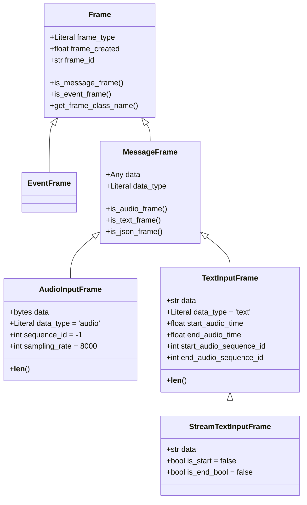

## Overview

This document explains the frame types defined in `types.py` and illustrates
their attributes and relationships. Frames are Pydantic models used to
transport data (audio, text, json) and events across components in the audio
processing pipeline.

## Frame class hierarchy (summary)

- Frame (base)
  - EventFrame
  - MessageFrame
    - AudioInputFrame
    - TextInputFrame
      - StreamTextInputFrame

## Class contracts

- Frame
  - Inputs: frame_type: "message" | "event"
  - Outputs: metadata fields for identification and timing
  - Key attributes: `frame_type`, `frame_created`, `frame_id`

- MessageFrame (Frame)
  - Inputs: `data`, `data_type` ('audio'|'text'|'json')
  - Methods: `is_audio_frame()`, `is_text_frame()`, `is_json_frame()`

- AudioInputFrame (MessageFrame)
  - Inputs: `data` (bytes), `sequence_id` (int), `sampling_rate` (int)
  - Fixed: `data_type = 'audio'`, `frame_type = 'message'`
  - Methods: `__len__()` -> number of bytes in `data`

- TextInputFrame (MessageFrame)
  - Inputs: `data` (str), audio-correlated timing fields
  - Fixed: `data_type = 'text'`, `frame_type = 'message'`
  - Timing attributes: `start_audio_time`, `end_audio_time`,
    `start_audio_sequence_id`, `end_audio_sequence_id`
  - Methods: `__len__()` -> number of characters in `data`

- StreamTextInputFrame (TextInputFrame)
  - Inputs: same as `TextInputFrame` plus `is_start` and `is_end_bool`
  - Purpose: indicate streaming boundaries for incremental transcription

## Object graph (Mermaid)

Below is a Mermaid class diagram representing the classes and their
attributes. If your README viewer supports Mermaid, this will render visually.

## ASCII object graph (fallback)

Frame
├─ EventFrame
└─ MessageFrame
   ├─ AudioInputFrame
   │   ├─ data: bytes
   │   ├─ data_type: 'audio'
   │   ├─ sequence_id: int (default -1)
   │   └─ sampling_rate: int (default 8000)
   └─ TextInputFrame
       ├─ data: str
       ├─ data_type: 'text'
       ├─ start_audio_time: float
       ├─ end_audio_time: float
       ├─ start_audio_sequence_id: int
       └─ end_audio_sequence_id: int
           └─ StreamTextInputFrame (adds)
               ├─ is_start: bool
               └─ is_end_bool: bool

## Notes and usage tips

- Use `AudioInputFrame` to pass raw audio bytes between producer and
  consumer coroutines. The `sequence_id` helps ordering; `sampling_rate`
  indicates how to interpret the bytes.
- Use `TextInputFrame` to attach transcriptions to the originating audio
  ranges. The `start_/end_audio_time` values use the same millisecond epoch
  as `frame_created` when appropriate.
- `StreamTextInputFrame` adds streaming flags for partial/intermediate
  transcriptions. `is_start` true indicates the beginning of a new
  transcription stream, `is_end_bool` true indicates termination.

## Mapping to code

- Source file: `ai_toolkits/audio/types.py`

If you want, I can also add small example snippets showing constructing
and serializing these frames, or convert this README into ReStructuredText
or rendered HTML.
